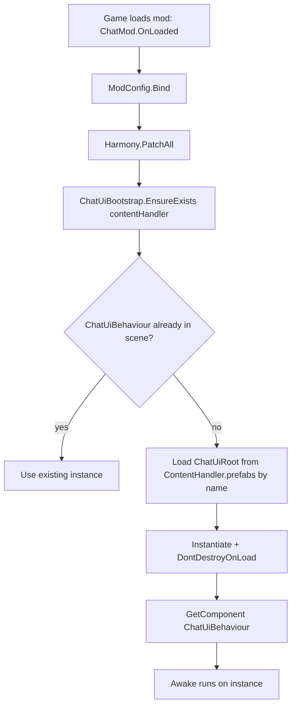
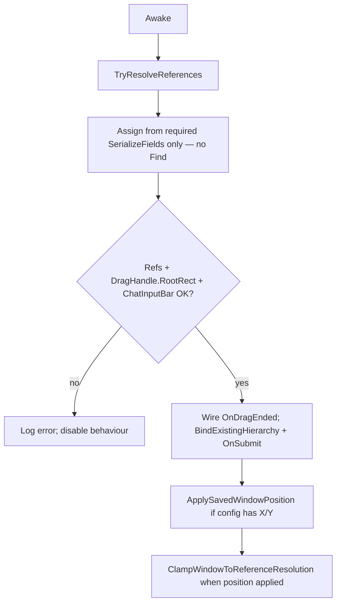
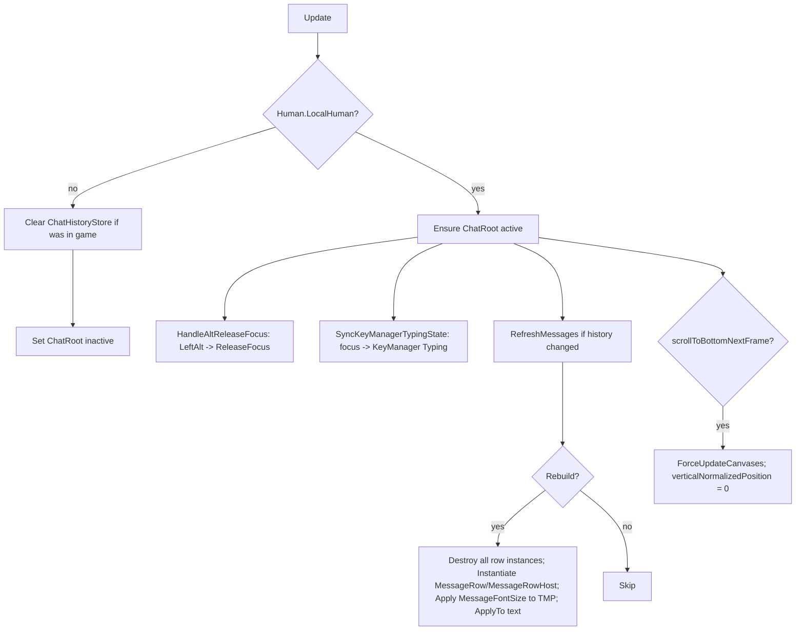
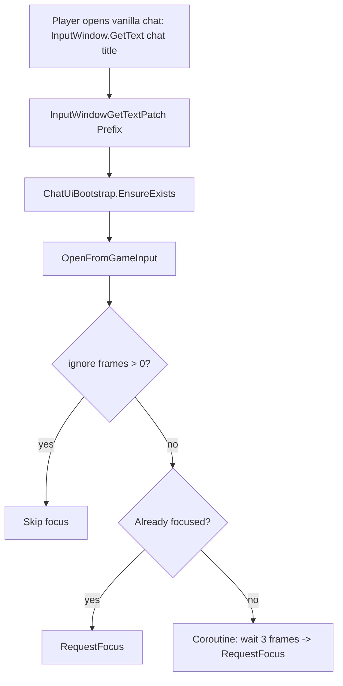
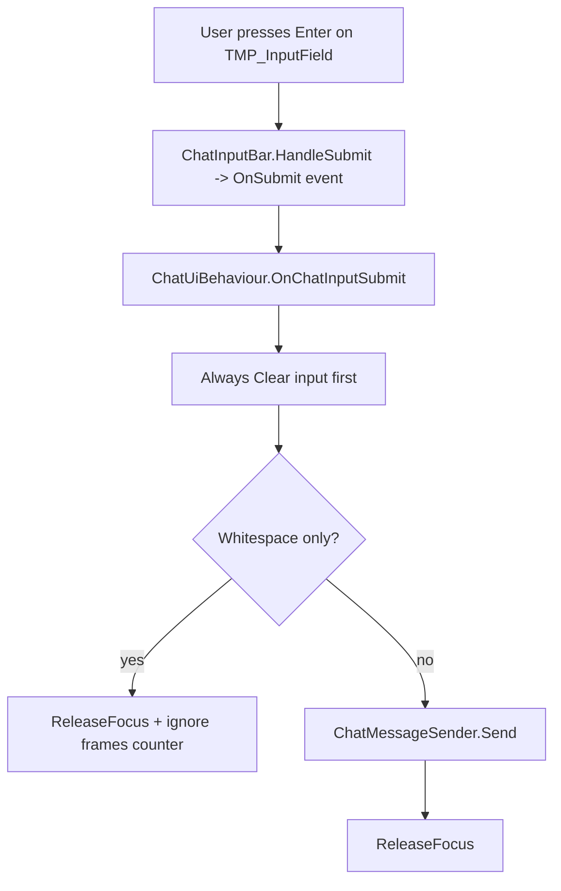
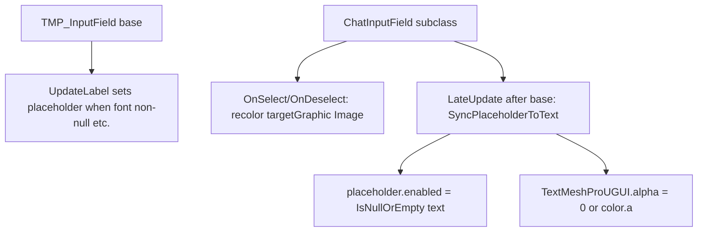

# ChatMod UI flow (as implemented today)

This document maps **runtime behavior** and highlights where **C# overrides or fights** authored prefab / TMP defaults. Mermaid renders in GitHub, many IDEs, and some Markdown previewers.

---

## 1. Startup (mod load)




**On `ChatUiBehaviour.Awake` (first frame of instance):**




**Takeaway:** At startup, code **requires** all **`ChatUiBehaviour` serialized references** (no `Transform.Find`), plus **`ChatPanelDragHandle` / `ChatInputBar`** on the prefab (no runtime `AddComponent`); **`MessageContent` is empty in the shipped prefab** (no runtime clear). **Config** can **overwrite** `ChatRoot` position and **clamp**. Notification sound: `ChatNotificationSound.Play()` beside DLL.

---

## 2. Every frame while in gameplay (`Update`)




**Takeaway:** Code drives **visibility** of the whole panel (in-game vs menu), **scroll position** when history changes, **keyboard/game input routing** (KeyManager), and **full rebuild** of message rows (destroy + instantiate). It does **not** resize ChatRoot or viewport each frame anymore (that was removed in favor of trusting the prefab).

---

## 3. Opening chat from the game (vanilla chat prompt)




---

## 4. Submitting from the mod input field (`Enter`)




**Takeaway:** **Clear runs before** branching. So the field is always emptied on submit attempt (including empty Enter). That is **by design** in code, not the prefab.

---

## 5. New chat lines appearing (history)

```mermaid
flowchart TD
  C[ChatMessage.PrintToConsole patch] --> H[ChatHistoryStore.Add]
  H --> E[ChatUiBootstrap.EnsureExists]
  C --> S[Optional ChatNotificationSound.Play]
  U[ConsoleWindow patch etc.] --> H
  H --> R[Next Update: RefreshMessages sees new snapshot]
  R --> B[Sync message rows (incremental trim/append)]
```


---

## 6. Input field: TMP vs `ChatInputField` (parallel to prefab)




**Takeaway:** This **overrides** default placeholder visibility every **LateUpdate** and tweaks **graphic colors** on select/deselect. If something feels “prefab should control it but doesn’t,” this layer is the first suspect—along with **TMP’s own** `DeactivateInputField` placeholder logic.

---

## Code vs prefab: who owns what?


| Area                                                 | Mostly prefab                 | Code still intervenes                                                       |
| ---------------------------------------------------- | ----------------------------- | --------------------------------------------------------------------------- |
| ChatRoot layout, colors, sizes                       | Yes                           | Position from config + clamp; drag moves `anchoredPosition`                 |
| Message row visuals (font, sprite layout per prefab) | Yes                           | **Replaces** entire `text` string; strips `(Host)` in formatting            |
| MessageContent at runtime                            | Empty in prefab                 | Rows **spawned** from **MessageRow** / **MessageRowHost**; **MessageFontSize** applied to each row TMP at spawn       |
| Scroll view                                          | Yes                           | Sets `verticalNormalizedPosition` to bottom on history change               |
| Input field layout                                   | Yes                           | May **add** `ChatInputBar`; **Clear** + **ReleaseFocus** on submit          |
| Placeholder / input chrome                           | Intended prefab + TMP         | **ChatInputField** forces placeholder enable/alpha; **Image** tint on focus |
| Panel visible in menu                                | —                             | **Hidden** when not `Human.LocalHuman`                                      |


---

## Glossary: “blur”

**Blur** here means the **input field loses focus** (same idea as “blur” in HTML): the caret leaves the field—typically because the user **clicks elsewhere**, **tabs away**, **Escape**, `**DeactivateInputField`**, or your code calls `**ReleaseFocus()**` (which clears EventSystem selection). It is **not** a graphics post-processing effect.

**Field “blurring” issue (recap):** If **typed text disappears** when you only click away, that is **not** explained by `OnChatInputSubmit` (that path clears only on **Enter/submit**). Then look for **prefab UnityEvents** (`onEndEdit`, etc.), **wrong TMP references**, or **game/mod** side effects. If the **placeholder** does not return when the field is **empty**, suspect **invisible characters** in `text`, **placeholder alpha/color**, or the **ChatInputField** sync fighting TMP.

---

## Font size + host sprite (design note)

**MessageFontSize** (config, integer **12–26**, default **18**) is applied to each spawned row **TMP** at runtime (auto-sizing off). If a **sprite** in the host row ever looks off-center at extreme sizes, tune the **sprite asset** or prefab rather than adding per-size prefabs—this mod assumes one **MessageRow** / **MessageRowHost** pair scales acceptably.

---

*Generated for the UnityChatMod project; update this file when behavior changes.*