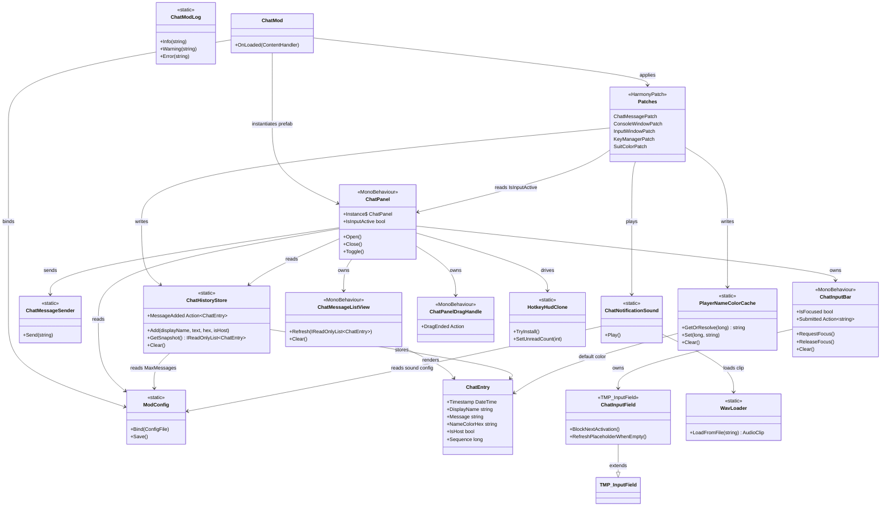
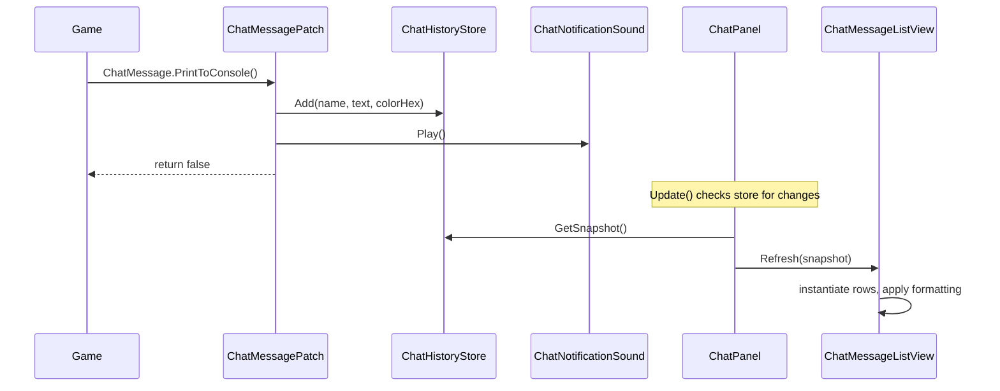
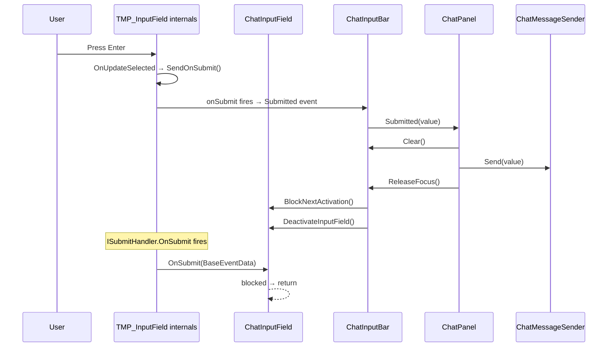

# ChatMod Architecture — Redesign Proposal

## The Problem With the Current Structure

The mod has four actual responsibilities — intercept game events, store chat data, render UI, play sounds — but 18 classes with tangled dependencies. The root cause isn't that there are too many classes; it's that the boundaries between them are wrong.

Specific violations:

- `ChatUiBehaviour` is a god object. It handles panel visibility, message rendering, input focus, hotkey polling, scene lifecycle, window persistence, and unread badge tracking. Every new feature touches this file.
- Data-layer classes reach into UI-layer classes. `PlayerNameColorCache` imports `ChatUiLayout` for a color constant. `ChatEntry` reads `ModConfig` directly.
- `ChatUiBootstrap` is a static forwarding layer that exists only because patches can't cleanly reach the UI. It holds mutable global state and duplicates the `ChatUiBehaviour` API surface.
- `ChatInputBar.Build()` is 70 lines of dead code that constructs a hierarchy the prefab already defines.
- `ChatUiLayout` mixes constants, unused methods, and font-size application logic into one grab-bag.
- `ChatHotkeyVanillaClone` is 300 lines that builds UI in code, manages its own lifecycle, and reaches back into `ChatUiBootstrap` to toggle the panel. It's a self-contained subsystem crammed into a static class.
- Namespace usage is inconsistent — some UI classes are `ChatMod`, others are `ChatMod.UI`.

The result: every change requires understanding the whole graph, and the class diagram looks like a dependency hairball.

---

## Design Principles for the Rewrite

1. Separation of Concerns — each class has one domain (data, UI, patching, audio)
2. Single Responsibility — each class has one reason to change
3. Law of Demeter — classes talk to their direct collaborators, not through chains

---

## Proposed Layer Architecture

```
┌─────────────────────────────────────────────────────────┐
│  ENTRY           ChatMod (OnLoaded → config, patches,   │
│                  prefab instantiation)                   │
├─────────────────────────────────────────────────────────┤
│  PATCHES         Thin Harmony prefixes/postfixes.        │
│                  Only call into Data layer.               │
│                  Never touch UI directly.                 │
├─────────────────────────────────────────────────────────┤
│  DATA            ChatHistoryStore, ChatEntry,            │
│                  ChatMessageSender, PlayerNameColorCache  │
│                  Pure data. No Unity UI imports.          │
├─────────────────────────────────────────────────────────┤
│  UI              ChatPanel, ChatMessageListView,         │
│                  ChatInputBar, ChatInputField,           │
│                  ChatPanelDragHandle, HotkeyHudClone     │
│                  Reads from Data layer. Never writes.     │
├─────────────────────────────────────────────────────────┤
│  AUDIO           ChatNotificationSound, WavLoader        │
│                  Called from Patches layer on new message.│
├─────────────────────────────────────────────────────────┤
│  CONFIG          ModConfig, ChatModLog                   │
│                  Read by all layers. Written by none      │
│                  except ModConfig.Save() for persistence. │
└─────────────────────────────────────────────────────────┘
```

Dependency rule: arrows point downward only. Patches → Data. UI → Data. Audio → Config. Nothing points upward.

---

## Proposed Class Diagram



---

## What Changes and Why

### Merges

| Current classes | Become | Rationale |
|---|---|---|
| `ChatUiBehaviour` + `ChatUiBootstrap` | `ChatPanel` | Bootstrap's only job was instantiating the prefab and forwarding calls. That's just `ChatPanel` initialization. One class, one singleton, one responsibility: panel lifecycle. |
| `ChatUiLayout` + `ChatMessageFormatting` | absorbed into `ChatMessageListView` | Layout applied font sizes to rows. Formatting built rich text for rows. Both are only called during row rendering. They're private implementation details of the list view, not shared utilities. |
| `ChatHotkeyVanillaClone` + `ChatHotkeyCloneMarker` | `HotkeyHudClone` | One feature, one file. The marker MonoBehaviour becomes a private nested class — it's an implementation detail of the clone, not a public type. |

### Deletions

| Removed | Rationale |
|---|---|
| `ChatInputBar.Build()` | Dead code. Prefab owns the hierarchy. |
| `ChatUiLayout.MinRowHeightForFontSize()` | Never called anywhere. |
| `ChatUiLayout.MessageTextColor` | Never referenced anywhere. |
| `ChatEntry.IsVisibleInCollapsedView()` | Data model reading global config. No callers in current code. If needed later, the caller should pass the duration. |
| `ChatUiBootstrap` (as separate class) | Merged into `ChatPanel`. |
| `ChatUiLayout` (as separate class) | Merged into `ChatMessageListView`. |
| `ChatMessageFormatting` (as separate class) | Merged into `ChatMessageListView`. |
| `ChatMessageRowMarker` (as separate class) | Becomes private nested class inside `ChatMessageListView`. |

### Moves

| What | From | To | Rationale |
|---|---|---|---|
| `DefaultNameColorHex` constant | `ChatUiLayout` | `ChatEntry` | It's a data default. `PlayerNameColorCache` and the list view both need it. Putting it on the data type eliminates the cross-layer dependency. |
| Prefab instantiation | `ChatUiBootstrap.EnsureExists()` | `ChatMod.OnLoaded()` | Entry point logic belongs in the entry point. |
| `InputWindowGetTextPatch` target | calls `ChatUiBootstrap.OpenFromGameInput()` | calls `ChatPanel.Instance?.Open()` | Direct call to the thing it actually wants. No forwarding layer. |

### Renames

| Current | Proposed | Rationale |
|---|---|---|
| `ChatUiBehaviour` | `ChatPanel` | Shorter, clearer. It's the chat panel. |
| `ChatHotkeyVanillaClone` | `HotkeyHudClone` | Shorter. "Vanilla" is implied — there's no other HUD to clone from. |
| `ChatInputBar.OnSubmit` event | `ChatInputBar.Submitted` | C# convention: events are past-tense. Avoids collision with `TMP_InputField.OnSubmit`. |
| `ChatHistoryStore.UnreadCandidateMessageAdded` | `ChatHistoryStore.MessageAdded` | The store shouldn't know about "unread" — that's a UI concept. Fire on every add; let the UI decide what's unread. |

### Structural fixes

| Fix | Rationale |
|---|---|
| `ModConfig` becomes `static class` | It only has static members. Prevents accidental instantiation. |
| All types use `namespace ChatMod` | Folder structure communicates grouping. Mixed namespaces (`ChatMod` vs `ChatMod.UI`) add friction without value in a mod this size. |
| `ChatHistoryStore.Clear()` no longer calls `PlayerNameColorCache.Clear()` | SRP violation. The store shouldn't know about the color cache. `ChatPanel` calls both when leaving gameplay. |

---

## Proposed Folder Structure

```
Assets/Scripts/
├── ChatMod.cs                          # Entry point (OnLoaded)
├── ChatModLog.cs                       # Logging
├── ModConfig.cs                        # BepInEx config bindings
│
├── Data/
│   ├── ChatEntry.cs                    # Message data model + DefaultNameColorHex
│   ├── ChatHistoryStore.cs             # Thread-safe message store
│   ├── ChatMessageSender.cs            # Network send logic
│   └── PlayerNameColorCache.cs         # HumanId → color hex cache
│
├── UI/
│   ├── ChatPanel.cs                    # Panel lifecycle, open/close/toggle, singleton
│   ├── ChatMessageListView.cs          # Message row rendering (owns formatting + layout)
│   ├── ChatInputBar.cs                 # Input field wrapper (focus, submit, clear)
│   ├── ChatInputField.cs               # TMP_InputField subclass (submit block, placeholder fix)
│   ├── ChatPanelDragHandle.cs          # Drag-to-move panel
│   └── HotkeyHudClone.cs              # Cloned vanilla HUD row + unread badge
│
├── Audio/
│   ├── ChatNotificationSound.cs        # Play notification
│   └── WavLoader.cs                    # PCM WAV → AudioClip
│
└── Patches/
    ├── ChatMessagePatch.cs             # Intercepts ChatMessage.PrintToConsole
    ├── ConsoleWindowPatch.cs           # Routes console lines to history
    ├── InputWindowPatch.cs             # Redirects vanilla chat input to mod UI
    ├── KeyManagerPatch.cs              # Blocks game input while typing
    └── SuitColorPatch.cs               # Refreshes color cache on suit change
```

16 files total. Down from 18, but more importantly: every file has one job, every folder is one layer, and the dependency arrows all point in the same direction.

---

## Message Flow (unchanged behavior, cleaner path)



---

## Submit / Focus Flow (unchanged behavior)



---

## Design Decisions

### Why ChatModLog has no diagram connections

`ChatModLog` is infrastructure — nearly every class calls it. Drawing those edges would turn the diagram back into a hairball for zero informational value. It's the same reason you wouldn't draw `ILogger` connections in a class diagram. It exists, everything uses it, and that's understood.

### Why ChatMessageListView.Refresh() is not a full rebuild

`Refresh(IReadOnlyList<ChatEntry>)` does incremental sync, not destroy-and-recreate. Internally it carries over the existing diffing logic: compare `Sequence` values on spawned row markers against the snapshot, trim stale rows from the head, append new rows at the tail. A full rebuild only happens as a fallback when sequence alignment breaks (e.g. after `Clear()`). The method signature means "here's the current truth, sync to match it" — not "throw everything away."

### Why consumers read ModConfig directly instead of receiving injected values

BepInEx `ConfigEntry<T>.Value` is designed for live reads. Tools like BepInEx Configuration Manager let users change settings at runtime without reloading the mod. If we froze config values at `OnLoaded` time and passed them down, runtime config changes would silently do nothing — users would change a setting, see no effect, and assume the mod is broken.

The tradeoff is that `ModConfig` becomes an implicit global dependency for every consumer. In a mod this size (16 files), that's an acceptable cost. The alternative — threading 8+ config values through constructors and method parameters just to reach leaf components — adds significant plumbing for a purity benefit that doesn't pay off here.

If unit testing becomes a priority later, the path forward is wrapping `ModConfig` behind an `IChatConfig` interface and injecting it. But that's a future concern, not a day-one requirement.

---

## Implementation Plan

Phases are ordered so that each one leaves the mod compilable and functional. No phase depends on a later phase. Each phase can be tested in-game before moving on.

---

### Phase 1 — Data layer cleanup

Goal: Make the data layer self-contained with no UI imports.

Steps:
1. Move `DefaultNameColorHex` from `ChatUiLayout` to `ChatEntry` as a `public const string`.
2. Update `PlayerNameColorCache` to reference `ChatEntry.DefaultNameColorHex` instead of `ChatUiLayout.DefaultNameColorHex`.
3. Remove `ChatEntry.IsVisibleInCollapsedView()` — no callers exist.
4. Rename `ChatHistoryStore.UnreadCandidateMessageAdded` to `ChatHistoryStore.MessageAdded`. Update the subscriber in `ChatUiBehaviour.OnEnable`/`OnDisable`.
5. Remove the `PlayerNameColorCache.Clear()` call from inside `ChatHistoryStore.Clear()`. Add a separate `PlayerNameColorCache.Clear()` call next to the existing `ChatHistoryStore.Clear()` call in `ChatUiBehaviour`.
6. Make `ModConfig` a `static class`.
7. Move data files to `Assets/Scripts/Data/`: `ChatEntry.cs`, `ChatHistoryStore.cs`, `ChatMessageSender.cs`, `PlayerNameColorCache.cs`.

Verify: mod compiles, messages still appear with correct name colors, history clears on session leave.

---

### Phase 2 — Dead code removal and ChatInputBar cleanup

Goal: Remove code that is unused or duplicated by the prefab.

Steps:
1. Delete `ChatInputBar.Build()` and the `_backgroundImage` field it populates (only used inside `Build`).
2. Remove the `System.Collections` using from `ChatInputBar` if no longer needed.
3. Delete `ChatUiLayout.MinRowHeightForFontSize()` — never called.
4. Delete `ChatUiLayout.MessageTextColor` — never referenced.

Verify: mod compiles, input field still works via prefab hierarchy, message rows still render.

---

### Phase 3 — Extract ChatMessageListView

Goal: Pull all message row rendering out of `ChatUiBehaviour` into a dedicated MonoBehaviour.

Steps:
1. Create `Assets/Scripts/UI/ChatMessageListView.cs` as a MonoBehaviour.
2. Move these methods from `ChatUiBehaviour` into `ChatMessageListView`:
   - `SyncMessageRows`
   - `FullRebuildMessageRows`
   - `TryAppendMessageRow`
   - `DestroyAllSpawnedMessageRows`
   - `DestroyMessageRowsAndResetMessageUiState` (rename to `ClearAndResetMetrics`)
3. Move the associated fields: `_spawnedMessageRows`, `_loggedMissingMessageRowPrefab`, `_lastRenderedCount`, `_lastRenderedLastTicks`, `_lastRenderedFirstSeq`, `_lastMessageCountForScroll`, `_scrollToBottomNextFrame`.
4. Move `ChatMessageRowMarker` into `ChatMessageListView` as a `private sealed class RowMarker`.
5. Absorb `ChatMessageFormatting.BuildLine`, `ChatMessageFormatting.ApplyTo`, `ChatMessageFormatting.StripHostSuffix` as private methods in `ChatMessageListView`.
6. Absorb `ChatUiLayout.ApplyConfiguredMessageFontSize` as a private method in `ChatMessageListView`. Move `DefaultMessageFontSize` to `ChatEntry` alongside `DefaultNameColorHex`.
7. Delete `ChatMessageFormatting.cs`, `ChatUiLayout.cs`, `ChatMessageRowMarker.cs`.
8. Add a `[SerializeField] private ChatMessageListView _messageListView` reference on `ChatUiBehaviour` (wired in the prefab, or resolved via `GetComponentInChildren`).
9. Replace the rendering calls in `ChatUiBehaviour.RefreshMessages` with `_messageListView.Refresh(snapshot)` and `_messageListView.Clear()`.
10. Expose `ScrollToBottom` on `ChatMessageListView` so `ChatUiBehaviour` can trigger it after refresh.

Verify: mod compiles, messages render correctly, scroll-to-bottom works on new messages, history clear works.

---

### Phase 4 — Merge ChatUiBootstrap into ChatPanel

Goal: Eliminate the static forwarding layer. Rename `ChatUiBehaviour` to `ChatPanel`.

Steps:
1. Rename `ChatUiBehaviour` to `ChatPanel` (class, file, all references).
2. Move prefab instantiation logic from `ChatUiBootstrap.EnsureExists()` into `ChatMod.OnLoaded()`. Store the prefab collection on `ChatPanel` as a static field so `TryGetNamedPrefab` still works.
3. Move `TryGetNamedPrefab` to `ChatPanel` as a `public static` method (it's called by `ChatMessageListView.TryAppendMessageRow`).
4. Rename `OpenFromGameInput` to `Open`. Rename `ToggleChatPanelHotkey` to `Toggle`.
5. Update all patch references: `InputWindowGetTextPatch` calls `ChatPanel.Instance?.Open()`. `KeyManagerInputPatches` reads `ChatPanel.Instance?.IsInputActive`.
6. Delete `ChatUiBootstrap.cs`.
7. Rename `ChatInputBar.OnSubmit` event to `ChatInputBar.Submitted`.

Verify: mod compiles, vanilla chat intercept opens mod panel, hotkey toggle works, input blocking works during typing.

---

### Phase 5 — Consolidate HotkeyHudClone

Goal: One file, one feature. Clean up the static-class-with-companion-MonoBehaviour pattern.

Steps:
1. Create `Assets/Scripts/UI/HotkeyHudClone.cs`.
2. Move `ChatHotkeyCloneMarker` into `HotkeyHudClone` as a `private sealed class CloneMarker : MonoBehaviour`.
3. Move all `ChatHotkeyVanillaClone` static methods and fields into `HotkeyHudClone`.
4. Update `HotkeyHudClone` to call `ChatPanel.Instance?.Toggle()` instead of `ChatUiBootstrap.ToggleChatPanelHotkey()`.
5. Delete `ChatHotkeyVanillaClone.cs` (the old file in `Assets/Scripts/UI/`).
6. Update `ChatPanel` references from `ChatHotkeyVanillaClone` to `HotkeyHudClone`.

Verify: mod compiles, HUD hotkey row appears in-game, clicking it toggles the panel, unread badge increments and clears.

---

### Phase 6 — Namespace and folder normalization

Goal: Consistent namespace, clean folder structure.

Steps:
1. Change all `namespace ChatMod.UI` and `namespace ChatMod.Patches` to `namespace ChatMod`.
2. Remove any `using ChatMod.UI;` or `using ChatMod.Patches;` statements that are no longer needed.
3. Move files to final folder structure:
   - `Assets/Scripts/UI/`: `ChatPanel.cs`, `ChatMessageListView.cs`, `ChatInputBar.cs`, `ChatInputField.cs`, `ChatPanelDragHandle.cs`, `HotkeyHudClone.cs`
   - `Assets/Scripts/Patches/`: `ChatMessagePatch.cs`, `ConsoleWindowPatch.cs`, `InputWindowPatch.cs`, `KeyManagerPatch.cs`, `SuitColorPatch.cs`
   - `Assets/Scripts/Audio/`: `ChatNotificationSound.cs`, `WavLoader.cs`
   - `Assets/Scripts/Data/`: `ChatEntry.cs`, `ChatHistoryStore.cs`, `ChatMessageSender.cs`, `PlayerNameColorCache.cs`
4. Rename patch files to shorter names:
   - `ChatMessagePrintToConsolePatch.cs` → `ChatMessagePatch.cs`
   - `ConsoleWindowPrintPatch.cs` → `ConsoleWindowPatch.cs`
   - `InputWindowGetTextPatch.cs` → `InputWindowPatch.cs`
   - `KeyManagerInputPatches.cs` → `KeyManagerPatch.cs`
   - `HumanSuitColorCachePatch.cs` → `SuitColorPatch.cs`
5. Update `ChatMod.asmdef` if assembly references changed.

Verify: mod compiles, full in-game test — send message, receive message, toggle panel, drag panel, hotkey works, sounds play, config changes apply at runtime.

---

### Phase summary

| Phase | Files created | Files deleted | Files modified | Risk |
|---|---|---|---|---|
| 1 — Data layer | 0 | 0 | 5 (`ChatEntry`, `PlayerNameColorCache`, `ChatHistoryStore`, `ChatUiBehaviour`, `ModConfig`) | Low — constant moves and dead code removal |
| 2 — Dead code | 0 | 0 | 2 (`ChatInputBar`, `ChatUiLayout`) | Low — removing unused code only |
| 3 — Extract list view | 1 (`ChatMessageListView`) | 3 (`ChatMessageFormatting`, `ChatUiLayout`, `ChatMessageRowMarker`) | 1 (`ChatUiBehaviour`) | Medium — largest behavioral change, needs careful testing of incremental row sync |
| 4 — Merge bootstrap | 0 | 1 (`ChatUiBootstrap`) | 5 (`ChatPanel`, `ChatMod`, patches) | Medium — rename touches many files, but logic is unchanged |
| 5 — Hotkey clone | 1 (`HotkeyHudClone`) | 1 (`ChatHotkeyVanillaClone.cs`) | 1 (`ChatPanel`) | Low — self-contained feature, internal restructure only |
| 6 — Namespace/folders | 0 | 0 | All | Low — mechanical rename, no logic changes |
